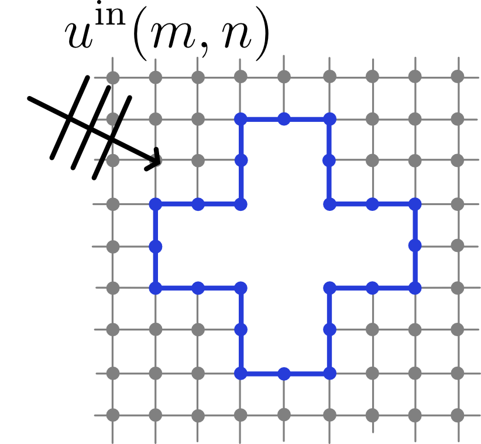
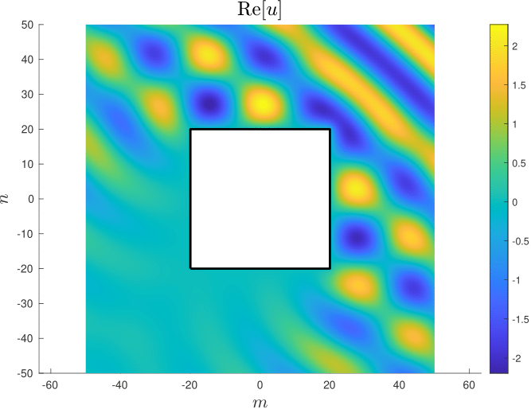
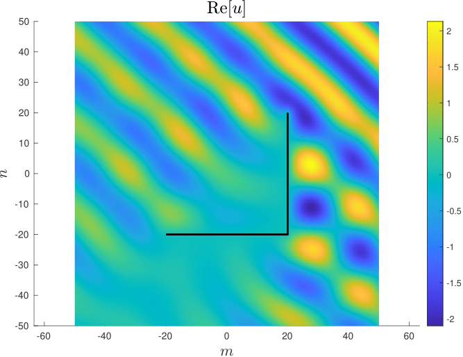
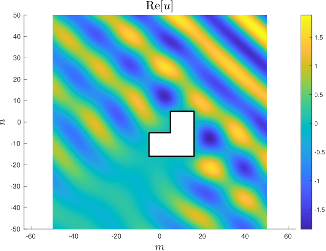

It is a FEM based MATLAB realisation of the method of boundary algebraic equations for the Helmholtz equation on a square lattice. For a quick start, just launch *main.m*. Below we briefly discuss the theory behind the code, followed by a  description of the structure of the MATLAB scripts. For a detailed description of the theory, the reader is referred to 

1. Korolkov, A. I., & Kisil, A. V. (2024). Embedding formulae for diffraction problems on square lattices. arXiv. [ArXiv]()

1. Poblet-Puig, J. and Shanin, A. V. (2018) A New Numerical Method for Solving the Acoustic Radiation Problem, Acoust. Phys. V. 64, pp. 252--259, [Link](https://doi.org/10.1134/S1063771018020148)  

## Problem statement 

We consider a problem of diffraction by a finite scatterer with Dirichlet boundary condition imposed on the surface:

$$ u(m,n) = 0, \quad (m,n) \in \partial \Omega$$

where the domain outside of the scatterer is $\Omega$ and $\partial \Omega$ is the set of surface nodes. 

The homogeneous discrete Helmholtz equation

$$ \Delta_{(m,n)}[u] + k^2 u_{(m,n)} = 0  $$

is satisfied in the rest of the domain. The operator $\Delta_{(m,n)}[\cdot]$ is the 2D discrete Laplace operator, which is a 5-point finite difference approximation of the continuos Laplace operator:

$$ \Delta_{(m,n)}[u] = u(m,n+1) + u(m,n-1) + u(m+1,n) + u(m-1,n)-4u(m,n). $$

By changing element matrices $K_{el}$ and $M_{el}$ in the script *Assemble_K_M.m* one can introduce more complicated approximations of the Laplace operator, as the 9-point FEM stencil.

The total field is a sum of an incident plane wave and the scattered field:

$$ u(m,n) = u^{\rm in}(m,n) + u^{\rm sc}(m,n), \quad u^{\rm in}(m,n) = (s^{\rm in})^{-m} (q^{\rm in})^{-n}, $$ 

were $s^{\rm in}$ and $q^{\rm in}$ are some solutions to the dispersion equation

$$ D_d(s,q) = s+ s^{-1} + q+q^{-1} + k^2-4 = 0 $$

with $|s^{\rm in}|>1$, $|q^{\rm in}|<1$, and
  
$$ \beta^{\rm in} = \frac{s^{\rm in} - (s^{\rm in})^{-1}}{q^{\rm in} - (q^{\rm in})^{-1}}. $$

## Directivity 

Define the directivity of the scattered field as follows:

$$ u^{\rm sc}(m,n) = g(m,n)S(\beta,\beta^{\rm in}) + O(N^{-3/2}),\quad N = \sqrt{m^2 + n^2}, \quad \beta=\frac{m}{n}, $$    

where $g(m,n)$ is the saddle point asymptotic of the free space Green's function, and $\beta$ is a rational number such that $\cot\beta = \theta$, where $\theta$ is the angle of observation.

## Method of boundary algebraic equations

Let's apply the Green's identity in $\Omega$ with $u_\nu^{\rm sc}$ and $G^\mu_\nu$, where the latter is the free field Green's function of the square lattice:

$$\Delta_\nu[G^\mu] + k^2G^\mu_\nu = \delta_{\mu,\nu}$$

 We obtain:

$$ \sum_{\nu \in \partial\Omega}(\partial_\nu[u^{\rm sc}]G^\mu_\nu - \partial_{\nu}[G^\mu]u^{\rm sc}_{\nu}) = 0 $$

where $\nu$ is a multi-index $\nu = \{m,n\}$. Using the fact that $u_\nu^{\rm sc}=-u_\nu^{in}$ on the surface of the scatterer and $G^\mu_\nu$ can be calculated via the integral reprsentation we arrive to the following system of algebraic equations:

$$ \sum_{\nu \in \partial\Omega}K_{\mu\nu}\partial_\nu[u^{\rm sc}] = F_\mu,\quad \mu \in \partial\Omega, $$

where

$$ K_{\mu\nu} = G^\mu_\nu ,\quad F_\mu = - \sum_{\nu}\partial_{\nu}[G^\mu]u^{\rm in}_{\nu}. $$

Solving it with respect to $\partial_\nu[u^{\rm sc}]$ and using  

$$S\left(\frac{m}{n}\right) = \sum_{\nu' \in \Omega_i}\partial_{\nu'}[u^{\rm sc}]s^{-m'} q^{-n'},\quad \frac{m}{n} = \frac{s - s^{-1}}{q - q^{-1}}$$

we recover the directivity of the scattered field.

The scattered field is reconstructed everywhere using Green's identity:

$$u_{\mu}^{\rm sc} = \sum_{\nu \in \partial\Omega}(\partial_\nu[u^{\rm sc}]G_\nu^\mu + \partial_{\nu}[G^\mu]u_{\nu}^{\rm in}), \quad \nu \in \Omega.$$

## Embedding formula 

The embedding formula expresses the directivity of the scattered field as a linear combination of the directivities of a set of other auxiliary plane wave problems:

$$\tilde S(\beta,\beta^{\rm in}) = \sum_{l=1}^NA_l\tilde S(\beta,\beta_l^{\rm in}),$$

where

$$\tilde S(\beta,\beta^{\rm in}) = (s+ s^{-1} - s^{\rm in}-(s^{\rm in})^{-1})S(\beta,\beta^{\rm in}).$$

Here $N$ is the number of auxiliary solutions, which depends on the geometry of the problem. Roughly, each outer angle and edge add two independent solutions. For example, for square one will need 4 solutions, and also 4 for a finite strip. For a finite angle, 6 solutions are required.

Coefficients $A_l$ are determined from the following linear system of equations:

$$-\tilde S(\beta^{\rm in},\beta_p^{\rm in}) =  \sum_{l=1}^NA_l\tilde S(\beta_p^{\rm in},\beta_l^{\rm in}), \quad p = 1\ldots N.$$

## Program structure

Script *main.m* launches everything that is needed to solve the diffraction problem. As a result, the geometry of the problem is plotted, the total field in some region around the scatterer is plotted, and the embedding formula is checked. The following scripts are launched: 

1. *Input geometry.m*. This script contains the geometry of the obstacle as an array of boundary nodes. For infinitely thin obstacles (strip, angles), nodes in arrays should be ordered.

1. *Mesher.m* . An FEM mesh is generated for the obstacle. The idea is simple: first, a big square mesh is generated, and the elements that fall inside the obstacle are removed. To assemble the matrices for BAE equations, only elements adjacent to the boundary are used. For a given geometry mesher can be launched only once

1. *Assemble_K_M.m*. Here, mass and stiffness matrices to construct $K_{\mu\nu}$ are assembeled in FEM fashion

1. *Compute_Greens_function.m*. The free field Green's function is evaluated by direct integration in the complex plane. Also, it could be launched once for a given wavenumber.

1.  *solver.m*. Solves the BAE for the given incidence parameter $\beta$ and a set of auxiliary  parameters $\beta_l$, which are used to implement the embedding formula.

1.  *field_recovery_for_plotting.m*. Recovers the total field in some domain from the boundary data (solution of BAE). Plots results.

1. *embedding.m*. Calculates directivity using the embedding formula. Plots the result along with the direct computation.

## Examples of numerics

